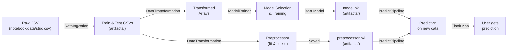

# ProjectML — Architecture

This document gives a concise, practical overview of the codebase so you can quickly understand how the project is organized and where to look to make changes.

## Purpose

Predict student performance using tabular features (gender, race/ethnicity, parental education, lunch, test preparation, reading and writing scores). The project contains ETL, preprocessing, model training, evaluation, and a small Flask web app for prediction.

## High-level components

- **Data ingestion:** [src/componenets/data_ingestion.py](src/componenets/data_ingestion.py) — reads the raw CSV (notebook/data/stud.csv path used), writes `artifacts/data.csv`, and creates train/test CSVs under `artifacts/`.
- **Data transformation / preprocessing:** [src/componenets/data_transformation.py](src/componenets/data_transformation.py) — builds the preprocessing pipeline (scaling, encoding, feature assembly) and produces transformed arrays and a `preprocessor.pkl` saved to `artifacts/`.
- **Model training & selection:** [src/componenets/model_trainer.py](src/componenets/model_trainer.py) — trains multiple regressors, evaluates via `evaluate_models` (in `src/utils.py`), selects the best model and saves `model.pkl` in `artifacts/`.
- **Pipelines:**
  - Training pipeline: [src/pipeline/train_pipeline.py](src/pipeline/train_pipeline.py) — orchestration of ingestion → transformation → training (notebook examples also available).
  - Prediction pipeline: [src/pipeline/predict_pipeline.py](src/pipeline/predict_pipeline.py) — loads `preprocessor.pkl` and `model.pkl` to transform incoming rows and return predictions. Also exposes `CustomData` to convert form input to a DataFrame.
- **Web app:** [app.py](app.py) — Flask application that renders templates (`templates/`) and calls `PredictPipeline` to produce predictions. See [docs/FLASK.md](docs/FLASK.md) for a route-by-route explanation.
- **Prediction pipeline:** [docs/PREDICTION_PIPELINE.md](docs/PREDICTION_PIPELINE.md) — detailed explanation of how one row becomes a prediction.
- **Training pipeline:** [docs/TRAINING_PIPELINE.md](docs/TRAINING_PIPELINE.md) — detailed explanation of the model training workflow.
- **Utilities & infra:** `src/utils.py`, `src/exception.py`, `src/logger.py` — helpers for saving/loading pickles, custom exceptions, and logging.
- **Artifacts & metadata:** `artifacts/` (CSV splits, `model.pkl`, `preprocessor.pkl`) and `catboost_info/` (training logs, catboost JSONs, TensorBoard events).

## Data flow (step-by-step)

### Visual dataflow



### Step by step

1. Raw data (notebook/data/stud.csv) is read by the ingestion component and saved to `artifacts/data.csv`.
2. Ingestion creates train/test CSVs (`artifacts/train.csv`, `artifacts/test.csv`).
3. Data transformation loads train/test, fits preprocessing (encoders/scalers) and emits transformed arrays plus `preprocessor.pkl`.
4. Model trainer consumes transformed arrays, runs multiple candidate models, chooses the best by score, and saves `model.pkl`.
5. `predict_pipeline.PredictPipeline` loads `preprocessor.pkl` and `model.pkl`, applies preprocessing to incoming rows and returns predictions.
6. `app.py` exposes a small Flask UI that collects form inputs, converts them via `CustomData`, and calls the prediction pipeline.

## Artifacts produced

- `artifacts/data.csv`, `artifacts/train.csv`, `artifacts/test.csv` — CSV datasets.
- `artifacts/preprocessor.pkl` — fitted preprocessing pipeline.
- `artifacts/model.pkl` — trained model object (dill/pickle).
- `catboost_info/` — CatBoost training metadata and TensorBoard events.

## Quick run & development notes

To install dependencies and run the web app locally:

```bash
pip install -r requirements.txt
python app.py
```

To train a model start with the provided notebook (`notebook/2. MODEL TRAINING.ipynb`) which shows the training flow. The code components under `src/componenets/` and `src/pipeline/` can be used to script the same steps programmatically.

## Where to look to make common changes

- Change preprocessing or features: [src/componenets/data_transformation.py](src/componenets/data_transformation.py).
- Change model selection / hyperparams: [src/componenets/model_trainer.py](src/componenets/model_trainer.py) and the `params` dictionary inside it.
- Change the prediction API / form fields: [app.py](app.py) and [src/pipeline/predict_pipeline.py](src/pipeline/predict_pipeline.py).
- Add tests: add pytest files under `tests/` and exercise `PredictPipeline` with small sample DataFrames.

## Next steps (suggested)

- Add a plain UML or dataflow diagram (PNG or Mermaid) to make the flow visual.
- Add a `CONTRIBUTING.md` with minimal steps for running the app and contributing.
- Add unit tests for `PredictPipeline.get_data_as_dataframe()` and `utils.evaluate_models()`.

If you want, I can add a simple Mermaid diagram and update this file with it next.
